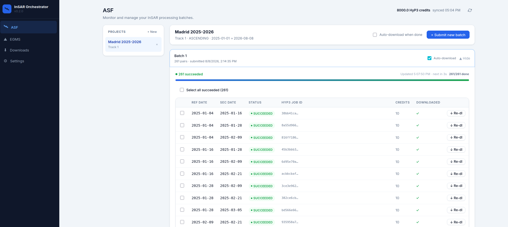
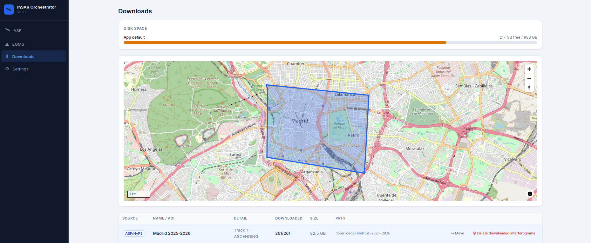

[](https://github.com/JSempereH/InSAR-Orchestrator/actions/workflows/ci.yml)
[](LICENSE)

A self-hosted, end-to-end InSAR processing platform for Sentinel-1 data. Instead of navigating ASF, HyP3, or ESGM dashboards separately, this tool centralises everything: draw an area on a map, discover available satellite tracks, submit interferometric pairs to HyP3 for cloud processing, monitor jobs in real time, and prepare results for MintPy SBAS analysis, all from a single web UI.

This tool is designed with research in mind. This is **not** a production tool, no warranty guaranteed.

---

## Architecture

```
insar-orchestrator/
├── packages/insar_core/   # Core Python library (pip-installable)
│   ├── adapters/          # ASF scene search, HyP3 SDK wrappers
│   ├── models/            # Pure dataclasses: SARScene, AOI, Job, …
│   └── pipeline/          # SBAS pair builder, orchestrator, MintPy adapter
├── backend/               # FastAPI REST API + WebSocket
│   └── app/
│       ├── routers/       # projects, batches, jobs, scenes, credentials, mintpy
│       └── services/      # HyP3 integration, polling loop, encryption
└── frontend/              # React 18 + Vite SPA
    └── src/
        ├── components/    # AOI map (MapLibre), job monitor, track picker
        └── pages/         # Dashboard, Projects wizard, Settings
```

This repo is scoped to InSAR: draw an AOI, discover tracks, submit pairs to
HyP3, monitor jobs, run MintPy SBAS on the results.

---

## Prerequisites

| Tool | Version | Notes |
|---|---|---|
| Python | ≥ 3.11 | For backend + core library |
| Node.js | ≥ 18 | For frontend |
| MintPy | ≥ 1.6.3 | Only needed for local SBAS analysis (`smallbaselineApp.py` must be in `PATH`) |
| NASA Earthdata account | — | Free at [urs.earthdata.nasa.gov](https://urs.earthdata.nasa.gov/users/new) |

---

## Setup

### Quick start

Requires [`uv`](https://docs.astral.sh/uv/getting-started/installation/) and Node.js ≥ 18 to be installed. Then:

```bash
git clone <repo-url> insar-orchestrator
cd insar-orchestrator
./setup.sh   # creates backend/.venv, installs backend + insar_core + frontend deps, prepares backend/.env
./dev.sh     # runs backend (:8000) and frontend (:5173) together, Ctrl+C stops both
```

That's it, skip to [step 3](#3-configure-earthdata-credentials) below to set up Earthdata credentials. The manual steps below are kept as a reference (e.g. for Windows, or if you don't want to use `uv`).

### 1. Clone and install the core library

```bash
git clone <repo-url> insar-orchestrator
cd insar-orchestrator
```

The `insar_core` library must be installed in the same Python environment as the backend:

```bash
cd backend
python -m venv .venv
source .venv/bin/activate        # Windows: .venv\Scripts\activate
pip install -r requirements.txt  # installs insar-core from ../packages/insar_core
```

### 2. Configure backend environment

Create `backend/.env` (never commit this file):

```bash
# backend/.env

# Optional: persistent encryption key for stored credentials.
# If omitted, a new key is generated each restart (credentials reset).
# Generate once and paste here:
#   python -c "from cryptography.fernet import Fernet; print('SECRET_KEY=' + Fernet.generate_key().decode())"
SECRET_KEY=

# Optional overrides (defaults shown):
# DATABASE_URL=sqlite:///./insar_app.db
# DOWNLOADS_DIR=./downloads
```

### 3. Configure Earthdata credentials

**Option A: environment variables (recommended for development):**

```bash
export EARTHDATA_USER=your_username
export EARTHDATA_PASS=your_password
```

**Option B: `~/.netrc`** (standard NASA tool format):

```
machine urs.earthdata.nasa.gov
    login your_username
    password your_password
```

```bash
chmod 600 ~/.netrc
```

**Option C: web UI** (Settings page): credentials are encrypted with Fernet before being stored in the database. Note this is a **research** tool. It is not intended for production, so do not expect production-grade security.


---

## Running the backend

```bash
cd backend
source .venv/bin/activate
uvicorn app.main:app --reload --host 0.0.0.0 --port 8000
```

The API will be available at `http://localhost:8000`. Interactive docs at `http://localhost:8000/docs`.

Key endpoints:

| Method | Path | Description |
|---|---|---|
| GET | `/api/health` | Health check |
| POST | `/api/projects` | Create a project (AOI + parameters) |
| GET | `/api/projects` | List all projects |
| GET | `/api/scenes/search` | Search ASF for Sentinel-1 scenes |
| GET | `/api/scenes/tracks` | Available tracks for an AOI + date range |
| POST | `/api/projects/{id}/batches` | Plan or submit a batch of pairs to HyP3 |
| GET | `/api/batches/{id}/jobs` | List jobs in a batch |
| PUT | `/api/jobs/{id}/download` | Download a completed job |
| POST | `/api/credentials` | Store encrypted Earthdata credentials |
| GET | `/api/credits` | Last known HyP3 credit balance, refreshed every 5 min (shown live in the dashboard) |
| POST | `/api/projects/{id}/mintpy/run` | Run MintPy SBAS over a project's downloaded interferograms (finishes the InSAR pipeline in-app; requires MintPy on this host) |
| WS | `/ws/batches/{id}` | Real-time job status stream |

---

## Running the frontend

```bash
cd frontend
npm install
npm run dev
```

Open `http://localhost:5173`. The app expects the backend at `http://localhost:8000`.

To build for production:

```bash
npm run build   # outputs to frontend/dist/
```

---

## Running everything in containers

`Dockerfile`s exist for `backend/` and `frontend/`, tied together by this
repo's own `docker-compose.yml`:

```bash
cp backend/.env.example backend/.env   # fill in SECRET_KEY
docker compose up --build
```

Or via this repo's own `Makefile`: `make docker-build` / `make docker-up`.
The backend image doesn't bundle MintPy - it's a large, separate scientific
stack you'd add explicitly if you want SBAS runs to happen inside the
container rather than on the host.

CI (`.github/workflows/ci.yml`) lints and tests `insar_core`, the backend,
and the frontend build on every push/PR.

---

## Using `insar_core` as a standalone library

The core library can be used independently from the web app, useful for scripting or research notebooks.

```python
from datetime import date
from insar_core import AOI, SearchParams, ASFAdapter, HyP3Adapter, build_sbas_pairs

# Define area of interest
aoi = AOI.from_bbox(lon_min=-1.25, lat_min=37.92, lon_max=-0.95, lat_max=38.08)

params = SearchParams(
    aoi=aoi,
    date_start=date(2022, 1, 1),
    date_end=date(2024, 12, 31),
    track_number=110,
    flight_direction="DESCENDING",
)

# Search scenes (no auth needed)
adapter = ASFAdapter()
scenes = adapter.search(params)
print(f"{len(scenes)} scenes found")

# Build SBAS pairs
pairs = build_sbas_pairs(scenes, max_temporal_neighbors=3)
print(f"{len(pairs)} interferometric pairs")

# Submit to HyP3 (requires Earthdata credentials)
from insar_core.credentials import load_earthdata_credentials
creds = load_earthdata_credentials()   # reads from env vars or ~/.netrc

hyp3 = HyP3Adapter(username=creds.username, password=creds.password)
for ref, sec in pairs[:1]:   # test with one pair first
    job = hyp3.submit_pair(ref.granule_name, sec.granule_name, name="my-project")
    print(f"Submitted: {job.hyp3_job_id} [{job.status}]")
```

---

## Screenshots

| ASF / HyP3 job monitor | Downloads overview |
|---|---|
|  |  |

---

## License

Licensed under the [European Union Public Licence v. 1.2](LICENSE) (EUPL-1.2).
